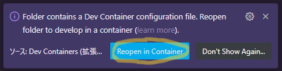

# aoj-js

## 使い方

1. `ctrl(cmd) + shift + P` または画面上部の `表示` からコマンドパレットを開く
1. `Dev Containers: Reopen in Container` を実行 (VSCode で aoj-js を開いたときに画面右下にでてくる以下のポップアップをクリックして開いても OK)

    

1. 画面上部の `ターミナル` から `新しいターミナル` または再度コマンドパレットを開き、`Terminal: Create New Terminal` を実行 (以下で出てくる make コマンドは開いたターミナルで実行する)
1. `make file PROBLEM=<問題>` で解答用のファイルを作成する (例: ITP1 1_B を解く場合 `make file PROBLEM=ITP1/1_B`)
1. src/ 以下に問題番号のディレクトリとその直下に解答用ファイルの main.js が作成されているので、そこにコードを書いていく
1. `make run PROBLEM=<問題>` でファイルを実行する
1. `shift + alt(⌥) + F` または `make fmt PROBLEM=<問題>` でファイルを整形できるので、まめに行っておく
1. 期待する動作になれば AOJ にコピペして提出する
1. AOJ での実行結果が `AC` であった場合は git に commit & push する
1. 終了する場合は VSCode ごと閉じて OK

## 標準入力について

例えば以下のようなコードで標準入力を受け取ることができる。(入力を終了するには `ctrl + D` を二回押下する。)

```js
const main = (stdin) => {
  console.log(` → "${stdin}" が入力されました。`);

  // 空白区切りの一行での入力 a, b を受け取る(空白 " " で文字列を split)
  const [a, b] = stdin.split(" ");
  // a, b を数値型として受け取る場合
  const [a, b] = stdin.split(" ").map(x => Number(x));

  // 入力を複数行受け取って配列にする(改行コード "\n" で文字列を split)
  const inputs = stdin.split("\n");
}

main(require("fs").readFileSync("/dev/stdin", "utf8"));
```

## git の設定

* ターミナルで `git --version` を実行し、git が使用できることを確認 (devcontainer を利用する場合、デフォルトで使用できるはず)
* `git config user.name` でユーザ名が設定されていることを確認
  * 設定されていなければ `git config --local user.name "<ユーザ名>"` で設定する
* `git config user.email` でメールアドレスが設定されていることを確認
  * 設定されていなければ `git config --local user.email "<メールアドレス>"` で設定する
